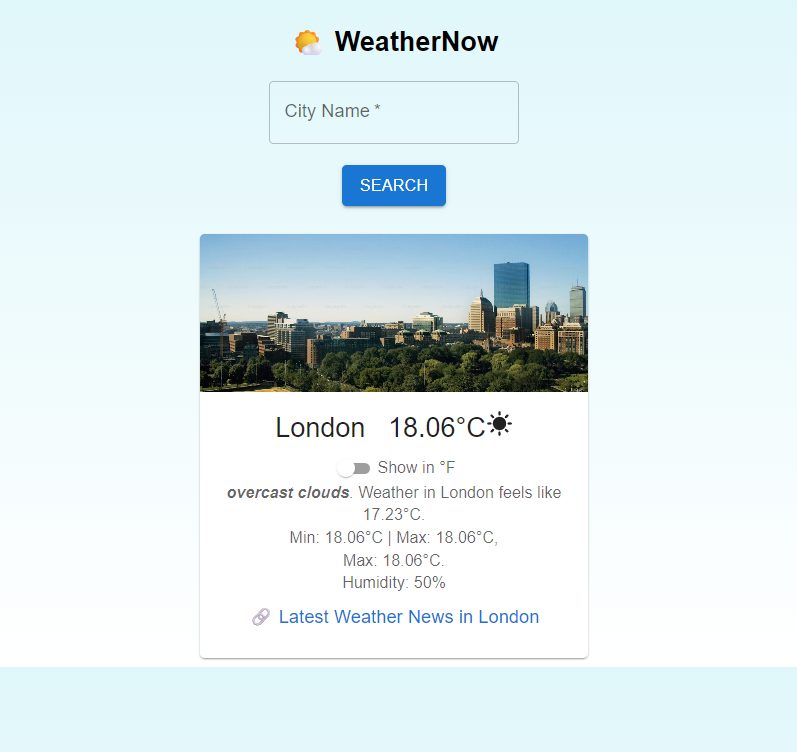

# Weather-Now
A responsive weather forecast application built in **React** and styled using **Material UI**. It dynamically adapts visuals based on weather conditions and gives users quick access to weather news.

## Live Demo
[Weather-Now App](https://weather-now-eight-bay.vercel.app/)

### 🌤️ Home Page

## Features
- **Celsius ↔ Fahrenheit toggle**
- **Dynamic backgrounds & icons** (hot, cold, rainy)
- **Weather details** (temp, humidity, feels-like, min/max)
- **Link to latest weather news** for the searched city
- Built with **Material UI** for sleek UI/UX

## Tech Stack
- React.js
- Material UI
- Weather API (e.g., OpenWeatherMap)
- Unsplash for imagery
- Hosted on **Vercel**

## Author & Repo
Author: Ankit (LeadWithAnkit)
Created by **Ankit (LeadWithAnkit)**
GitHub: [github.com/LeadWithAnkit](https://github.com/LeadWithAnkit)
